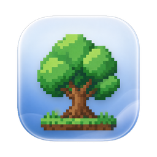
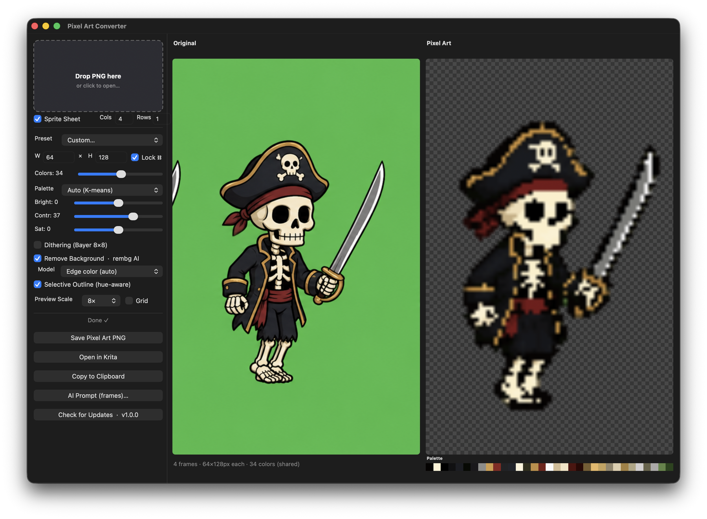

<div align="center">



# Pixel Art Converter

### Turn AI illustrations into game-ready pixel art — single sprites or animation sheets, locally on your Mac, in seconds.


**[⬇ Download Latest Release](https://github.com/ahmetolcum/PixelArtConverter/releases/latest)** — `.dmg` for macOS, `.zip` for Windows, `.tar.gz` for Linux. &nbsp;·&nbsp; [Documentation](#documentation) &nbsp;·&nbsp; [Roadmap](#roadmap)

<br/>



</div>

---

## What is this?

You can generate beautiful illustrations with Stable Diffusion, Midjourney, ChatGPT/DALL-E, Sora — but **game engines don't want a 1024×1024 illustration**. They want:

- **16×16 to 256×256 sprites** at exact pixel dimensions
- **Limited palettes** (8–64 colors), often a specific Lospec palette
- **Hard-edged pixels** with zero anti-aliasing
- **Clean transparent backgrounds** for compositing
- **Sprite sheets** for animation, with the **same colors across every frame** so the character doesn't flicker

Pixel Art Converter does all of that, **locally**, in seconds. Drop in your AI illustration. Get a usable game asset out.

---

## ✨ Features

### 🎨 Pixel-perfect conversion pipeline

- **Edge-preserving bilateral smoothing** — flat regions become flat without blurring shape boundaries
- **CIELAB perceptual K-means** — chosen colors look right to humans, not just statistics
- **Majority-vote downscaling** — picks the dominant palette color per source block; never blends, never produces muddy in-between pixels
- **Strict pixel-art invariants:** every pixel is fully opaque or fully transparent (no partial alpha), every RGB color is a palette-exact match

### 🌈 Lospec palette support

- **10 bundled palettes** ready to use: PICO-8, Sweetie 16, Endesga 32, Resurrect 64, AAP-64, Apollo (46), NA16, Slso8, Nyx8, Game Boy
- **Load ANY palette from Lospec** by slug (`pico-8`, `vintage-berry`) or full URL — fetched on demand and cached for the session
- **Auto K-means** mode for when you don't want to lock to a specific palette

### 🎬 Animation / sprite-sheet output

- Drop **multiple PNG frames** → get a horizontal sprite sheet
- Or drop a **single sprite sheet image** + set Rows × Cols → app splits, processes, recombines
- **Frame-coherent palette:** one shared palette across every frame, so colors don't flicker
- Filename auto-suggests `name_7frames_64x64.png` — game engines slice by reading frame size

### 🤖 AI-first workflow

- **Built-in prompt generator** with two modes (animation sprite sheet / single image) and two targets (**ChatGPT/DALL-E 3** and **Gemini/Imagen**). The Gemini variant explicitly demands iconic mascot detail, thick black outlines, gold trim, and full prop/accessory rendering — the same prompt produces noticeably plainer art on Gemini otherwise.
- **View** and **Background** dropdowns in both modes — pick from common camera angles (side, front 3/4, isometric, top-down…) and solid background colors that the converter keys out automatically.
- **Action presets** (walk, run, idle, jump, sit, sword swing, cast spell pose, hurt, death, wave) auto-fill frame-by-frame choreographies. The cast-spell preset is **pose-only with no spell visuals** — composite any spell effect in afterwards.
- **Edge-color background removal** — purpose-built for the solid-color backgrounds AI tools produce. Far more reliable than AI background removers (rembg / u2net / isnet) on stylized inputs.
- AI-failure fallbacks: if rembg can't find a subject, the app keeps the original image and warns you instead of silently deleting everything.

### 🍎 Native macOS Tahoe icon

- Ships a **layered `.icon`** (Icon Composer format) compiled into the app's `Assets.car`. macOS Tahoe (26+) renders it dynamically with light, dark, tinted, clear and glass styles — same icon, system-styled.
- Falls back to a flat `.icns` on Big Sur through Sequoia, so older Macs still get a clean app icon.

### 🔍 Pro preview

- **Pan with mouse drag** when the scaled sprite overflows the panel (open-hand cursor)
- **Nearest-neighbor zoom** at 1×, 2×, 4×, 8× — pixels stay hard-edged at every scale
- **Optional pixel grid overlay** to inspect every cell individually
- **Resizable window** — both preview panels grow with the window

### 🎛️ Fine controls

- **Brightness / Contrast / Saturation** sliders, applied pre-quantization
- **Bayer 8×8 ordered dithering** — produces handmade-looking checker patterns instead of Floyd-Steinberg noise
- **Selective outlining** — outline color is a darkened version of the adjacent material's color (in CIELAB), automatically snapped to the active palette
- **Multiple background-removal methods** — rembg AI (`isnet-general-use`, `isnet-anime`, `u2net`, `u2net_human_seg`) or color-key keying

> **Background-removal model downloads.** The four AI models are not bundled with the app — each one downloads from GitHub the first time you select it (~175 MB per model, ~700 MB total if you try them all) and caches in `~/.u2net/`. The app shows a progress dialog during the download and you can cancel it; subsequent uses of that model are instant. The default **Edge color (auto)** option needs no download and works fully offline.

---

## 🚀 Quick Start

1. **[Download the .dmg](https://github.com/ahmetolcum/PixelArtConverter/releases/latest)** (~445 MB), open it, drag **Pixel Art Converter** into your **Applications** folder.
2. Open the app. See the section below if macOS blocks it on first launch.
3. **Drop a PNG** into the app, pick your output size and palette, click **Save Pixel Art PNG**. Done.

For animation: drop multiple PNGs at once (or tick **Sprite Sheet** and drop one grid image), and the **Save** button produces a sprite sheet PNG with palette-coherent colors across every frame.

### ⚠️ Opening an unsigned macOS app — first launch only

The current release is **not yet signed** with an Apple Developer certificate (planned for v1.1). On first launch, macOS Gatekeeper will refuse to open the app and show one of these messages:

> *"Pixel Art Converter" cannot be opened because the developer cannot be verified.*

> *"Pixel Art Converter" is damaged and can't be opened. You should move it to the Trash.* (This appears on Sequoia/Tahoe; the app is not actually damaged — Gatekeeper marks unsigned downloads with a quarantine flag.)

You only need to do **one** of the following the **first time** you launch. After that, the app opens normally with a double-click.

**Option A — Right-click → Open (works on all macOS versions):**

1. **Right-click** (or two-finger click / Control-click) the app in Applications → choose **Open**
2. Click **Open** in the confirmation dialog
3. Done. Future launches work normally.

**Option B — System Settings (if Option A doesn't appear):**

1. Try to open the app normally; macOS will block it
2. Open **System Settings → Privacy & Security**, scroll to **Security**
3. You'll see *"'Pixel Art Converter' was blocked from use…"* — click **Open Anyway**
4. Re-launch the app, click **Open** in the confirmation

**Option C — Terminal (Sequoia / Tahoe, when the "damaged" message appears):**

If you installed to **`/Applications/`** (system-wide, the usual place from drag-to-Applications):

```bash
xattr -dr com.apple.quarantine "/Applications/Pixel Art Converter.app"
```

If you installed to **`~/Applications/`** (your user folder):

```bash
xattr -dr com.apple.quarantine ~/Applications/Pixel\ Art\ Converter.app
```

If you're not sure where it is, this finds it and clears the flag wherever it lives:

```bash
sudo xattr -dr com.apple.quarantine "$(mdfind 'kMDItemFSName == "Pixel Art Converter.app"' | head -1)"
```

Any of these removes the quarantine flag set on downloads. Then double-click the app — it opens normally.

This is **standard for unsigned indie apps**. The app does nothing it doesn't claim — all source is in this repo. The signed v1.1 release will eliminate the warning.

### Verify the download (optional)

If you want to verify the DMG matches what's published:

```bash
shasum -a 256 ~/Downloads/PixelArtConverter-1.2.0.dmg
# expected: 69a5eefa69e520a7a1e5d2ea97721d3c28e6d3604c4ac856eb9b4883cff992a9
```

---

## 🎯 Who is this for?

| User | Why it helps |
|---|---|
| **Indie game devs** | Turn AI-generated concept art into Unity/Godot/GameMaker-ready sprite sheets without leaving the desktop. |
| **AI artists** | Finish your generations: get clean palette-quantized exports with proper transparency. |
| **Pixel artists** | Skip Photoshop's quantize dialog. Lospec palettes, dithering, and outlining built in. |
| **Asset packers** | Ship multiple resolutions and palettes from one source illustration with a couple of clicks. |
| **Hobbyists** | Experiment with retro Game Boy / NES looks on photos and modern art. |

---

## 📚 Documentation

### Two ways to provide animation frames

**A. Multiple separate PNGs**

- Drop multiple files at once, or shift-click in the open dialog to multi-select.
- Files are sorted alphabetically. Name them `walk_01.png`, `walk_02.png`, etc.
- App processes each frame and composes a horizontal sprite sheet.

**B. A single sprite-sheet image**

- Tick the **Sprite Sheet** checkbox.
- Set **Cols × Rows** to match the input grid.
- Drop a single PNG. The app splits, processes, and recomposes.

In both modes, **one shared palette** is built across all frames so colors don't flicker.

### Settings reference

| Control | Effect |
|---|---|
| **Preset / W × H** | Output sprite dimensions |
| **Lock** | Keeps W:H aspect ratio when editing |
| **Colors** | Auto-mode palette size (4–64) |
| **Palette** | Auto K-means or a Lospec palette |
| **Bright / Contr / Sat** | Pre-quantization adjustments (−100 to +100) |
| **Dithering** | 8×8 Bayer ordered dither |
| **Remove Background** | Background removal toggle |
| **Model** | rembg AI model OR Edge-color (auto) keying |
| **Selective Outline** | Hue-aware 1px outline |
| **Preview Scale / Grid** | Visual zoom + pixel grid |
| **Sprite Sheet** | Single image dropped is split by Cols × Rows |

### Mouse controls

- **Drag** preview panels to pan when content overflows
- Cursor turns into open-hand when panning is available

### Generating input with AI

The app includes an **AI Prompt Samples** button that opens a window where you can:

- Pick **Type**: animation frames sprite sheet, or a single image
- Pick **Target** model: **ChatGPT (DALL-E 3)** or **Gemini (Imagen)** — the templates differ. Gemini's variant pushes harder for iconic mascot detail, thick outlines, gold trim, and explicit accessories, since the same prompt tends to give plainer art on Gemini otherwise.
- Pick an **Action preset** (walk, run, idle, jump, sit, sword swing, cast spell pose, hurt, death, wave) for a ready-made frame-by-frame choreography
- Fill in **Subject** (the character/object that must stay identical), **View** (camera angle), and **Background** (solid color the converter keys out)
- For frames mode: **Frame count (N)** and a per-frame **Action** description

Variables are colored in blue in the live-rendered prompt so you can see at a glance what's yours vs boilerplate. Click **Copy Prompt** and paste into ChatGPT or Gemini.

---

## 👨‍💻 For developers

The app is a single Python file (~1700 lines) using PyObjC + AppKit. Run from source:

```bash
git clone https://github.com/ahmetolcum/PixelArtConverter.git
cd PixelArtConverter
pip3 install Pillow numpy scikit-image scikit-learn pyobjc "rembg[cpu]"
python3 pixel_art_converter.py
```

To build a `.dmg`:

```bash
pip3 install py2app
python3 setup.py py2app
hdiutil create -volname "Pixel Art Converter" -srcfolder dist/ -ov -format UDZO PixelArtConverter.dmg
```

(A `setup.py` will be added to the repo with `py2app` config.)

---

## 🗺️ Roadmap

- [ ] Notarized & signed `.dmg` (no more Gatekeeper friction)
- [ ] Animated GIF export option
- [ ] Frame-by-frame preview scrubbing with FPS slider
- [ ] Sprite sheet grid auto-detection
- [ ] Apple Silicon-optimized standalone binary
- [ ] Linux build (PyObjC will need a swap to PySide/Qt)
- [ ] Batch CLI mode for headless conversion

---

## 🛠️ Built with

[Python](https://www.python.org/) · [PyObjC](https://pyobjc.readthedocs.io/) · [Pillow](https://pillow.readthedocs.io/) · [scikit-image](https://scikit-image.org/) · [scikit-learn](https://scikit-learn.org/) · [rembg](https://github.com/danielgatis/rembg) · [Lospec](https://lospec.com/)

---

## 🤝 Contributing

Pull requests welcome. For substantial changes, open an issue first to discuss.

The app deliberately doesn't try to do creative-judgment tasks (light source detection, "smooth jagged curves," three-colors-per-material enforcement). Those need a human in Aseprite/Krita. PRs that add such heuristics are likely to be declined unless they ship with a kill-switch and don't degrade the simple cases.

---

## 📜 License

MIT — see [LICENSE](LICENSE).

Lospec palettes are © their respective creators and are bundled here under their permitted reuse terms (most are CC0 or fair-use compatible). If you're a palette author and want yours removed, please open an issue.
